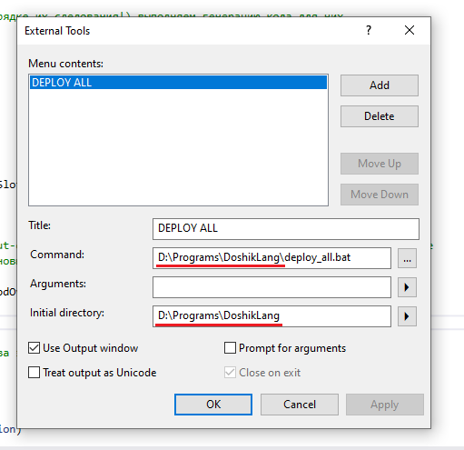

# Making vrchat udon based language here :)

Language is similar to C#, but much more simple and less powerful.

Language lexer and parser are generated by Antlr4 using grammar files (.g4)

Work in progress (early stage)...

# Usage

Result of building all that is ```DoshikSDK``` folder (```DoshikSDKAssets\Assets\DoshikSDK```) that you could copy-paste to your Unity3d world project's assets folder.
It must be next to ```VRCSDK/``` and ```Udon/``` folder (you get it by installing vrchat sdk 3 and udon sdk in your world project)

Other thing that is building is vscode extension for doshik language (```vscode-extensions\doshik```). Just put it to ```%USERPROFILE%\.vscode\extensions``` (I'll publish it as extension package when it releases, but for now it has to be manually copied)

To run compiler outside of Unity3D editor, you can use Tester project. It compiles ```test.doshik``` file from Tester project directory and prints out compiled assembly language listing

# Build & Requirments

* Node.js and NPM (try current LTS version) has to be installed. It is for building vs code extension's dependencies
* Powershell Core (6) has to be installed. It is for running deploy scripts (or you can just do it all manually)
* Visual studio 2019 with some basic packages has to be installed. I only tested it with this setup, but i'm sure 2017, or even VS Code + some dotnet sdk will do

Put Unity3D (couple of dll's from unity editor), Udon (Udon SDK) and VRCSDK (VRCHAT SDK 3) folders to ```ExternalDlls``` folder (navigate to ```ExternalDlls``` folder to see readme).
These have to be set in order to compile udon api generator library.

When it's all done, you can now rebuild whole solution file ```DoshikLang.sln``` in visual studio. It will build all projects except for DoshikLangAntlr and vscode extension javascript side stuff.
If it all compiles, you can now deploy it or run Tester project to see how it works on sample ```test.doshik``` file.

notes:
* DoshikLangAntlr project doesn't need to be compiled until language syntax is changed (it's excluded from solution build). Project purpose is to keep language syntax files (.g4) and generate ```/DoshikLangCompiler/AntlrGenerated/**``` files which are get commited. Compilation from .g4 to generated files is done by use of AntlrVSIX visual studio 2019 extension
* vs code extension javascript thing has to be build separetely (for now it's just running ```npm install``` on it (it's being called from deploy script), but maby i'll change it to typescipt and it would require another ts => js build step).

# Deployment

There are couple of files for deployment:
* deploy_binaries_debug.bat - deploys built dll's to project's external folders (doshikSdk external folder and vs code extensions's server folder)
* deploy_unity_project.bat - deploys ```DoshikSDKAssets``` to your specific unity3d world project
* deploy_vscode_extension.bat - deploys ```vscode-extensions``` to folder where VS Code can see it
* deploy_all.bat - combination of all other deploy scripts. Deploys everything (Unity3D sdk package and vs code extension) after visual studio project is built.

For deploy_unity_project.bat and deploy_all.bat you'll also have to set environment variable with name ```DOSHIKUNITYPROJECT``` to your specific Unity3D project where you want DoshikSDK to be copied. It has to be root folder of a project without terminating ```/``` slash. For example ```D:\Unity3DProjects\MyUdonProject```

To ultimately deploy everything - it's enough to just run ```deploy_all.bat```. It's recommended to close VS Code and Unity3D project before deployment of any of this, as it changes files being used by them.

I personally use ```Tools/external tools``` visual studio feature to run deploy_all.bat after whole project rebuild. Here is how i setup it:



red underline is path to solution directory (where deployment .bat files are)